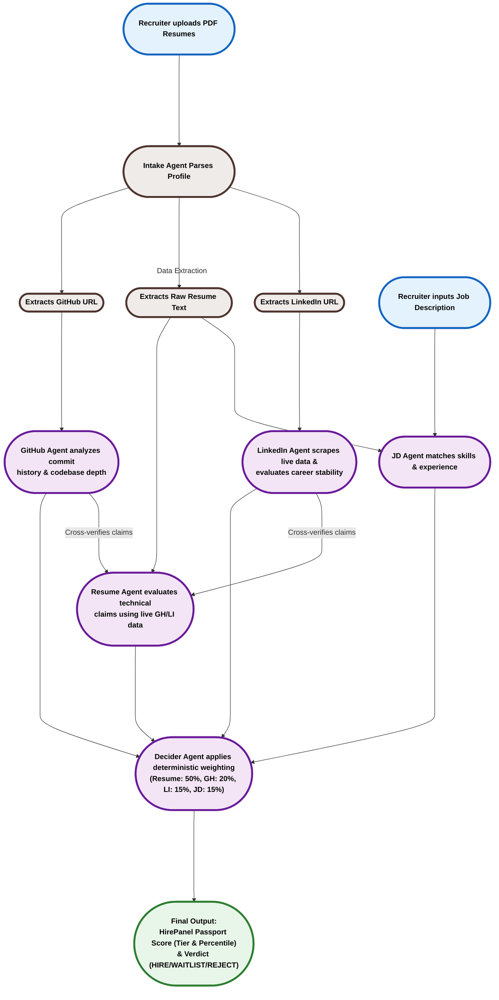

<div align="center">
  <h1>HirePanel.ai</h1>
  <h3>The Industry-Grade AI Hiring Committee</h3>
  <br />

  <p>HirePanel.ai is a multi-agent screening system that automates the initial stages of technical recruiting with extreme accuracy. By parsing uploaded resumes, scraping live GitHub repositories, fetching live LinkedIn profiles via Scrapingdog, and running cross-verification checks, HirePanel delivers a mathematically weighted consensus verdict, complete with percentile rankings and tier classifications, in seconds.</p>

  <h3>Links</h3>
  <p>
    <a href="https://www.linkedin.com/posts/mahesh-nandigam_ai-agenticai-techcommunity-ugcPost-7474855620551241728-O5H9/?utm_source=share&utm_medium=member_desktop&rcm=ACoAADW99hsBJVeFIsEk7TLOg9YovphT7Sd-cWg">Live Video Demo</a> | <a href="https://hire-panel-ai.vercel.app">Live App Link</a>
  </p>
</div>

---

## Architecture and Agent Choreography

HirePanel.ai structures candidate screening as a pipeline of cooperative, specialized AI agents. The workflow progresses sequentially, utilizing external APIs for live data gathering and cross-verification before issuing a deterministic final score:



---

## Workflow & Agent Responsibilities

1. **Intake Agent**: Extracts structured candidate info (raw text, portfolio links, contact data) from raw PDF resume files.
2. **GitHub Agent**: Reviews candidate repositories, inspecting commit frequency, codebase architecture, and language profile metrics.
3. **LinkedIn Agent**: Audits work history timelines, job tenure length, and career progression using live data scraped via the Scrapingdog API. Enforces strict penalties for candidates lacking formal corporate experience.
4. **JD Agent**: Maps raw resume details against job expectations to calculate a primary JD alignment score.
5. **Resume Agent**: Reads self-claimed skills and cross-verifies project existence directly with the outputs of the GitHub and LinkedIn Agents. Flagrantly unverified claims are heavily penalized.
6. **Decider Agent**: Aggregates the four sub-scores into a deterministically weighted final score (Resume: 50%, GitHub: 20%, LinkedIn: 15%, JD: 15%). The frontend then computes the candidate's relative **Percentile** and assigns a **HirePanel Passport Tier (A, B, C, D)**.

---

## Key Features

- **Live Data Scraping**: Integrates with Scrapingdog to pull live LinkedIn profiles, bypassing the limitations of static PDF resumes.
- **Corporate Experience Penalty Rule**: Mathematically enforces industry-standard screening rules. Candidates who list only academic projects, student clubs, or lack real corporate titles face aggressive score caps, mimicking elite Fortune 500 filtering algorithms.
- **HirePanel Passport Tiers**: Candidates aren't just given raw scores. The system calculates their relative percentile against the rest of the batch and categorizes them into Tiers (A, B, C, D), allowing recruiters to immediately identify the top 10% of applicants.
- **Bi-Directional Skill Verification**: The Resume Agent delays its evaluation until the GitHub and LinkedIn Agents finish, allowing it to cross-reference self-claimed skills against live repository and tenure evidence.
- **Lightning Fast Llama-3.1-8b**: Powered by NVIDIA's high-speed enterprise API endpoints (`meta/llama-3.1-8b-instruct`), the multi-agent orchestration runs concurrently without hitting API bottlenecks.

---

## Technical Stack

### Frontend
- **Framework**: React 18 (Vite)
- **Styling**: Tailwind CSS
- **State Management & UI**: Tailwind UI components, Custom Isometric Wave Animation UI

### Backend
- **Engine**: FastAPI (Python 3.10+)
- **File Processing**: PyMuPDF & PyPDF (parsing and token-reduction of PDF files)
- **Orchestration**: Asynchronous Python (asyncio) concurrent loops

### Models & APIs
- **Primary LLM**: `meta/llama-3.1-8b-instruct` (via NVIDIA API)
- **Live Scraping**: Scrapingdog API (LinkedIn Profile endpoint)

---

## Codebase Structure

```directory
hirepanel.ai/
├── src/
│   ├── main.py                 # FastAPI Application (Endpoints: /api/intake, /api/evaluate)
│   ├── agents/
│   │   ├── intake_agent.py     # Parses PDFs and extracts structured URLs
│   │   ├── jd_agent.py         # Matches candidate experiences to the target job description
│   │   ├── github_agent.py     # Analyzes developer profiles and code repository footprints
│   │   ├── linkedin_agent.py   # Scrapes live LinkedIn profiles and audits tenure
│   │   └── resume_agent.py     # Cross-verifies skills against live GH/LI data
│   └── utils/
│       └── llm_client.py       # LLM client configured for NVIDIA API & concurrency
├── frontend/
│   ├── src/                    # React (Vite) Frontend Components & Dashboard UI
│   ├── package.json
│   └── vite.config.js
├── Dockerfile                  # Application deployment packaging
└── requirements.txt            # Backend Python dependencies
```

---

## Installation & Setup Guide

### Prerequisites
Make sure you have the following installed on your machine:
- **Python 3.10 or higher**
- **Node.js 18 or higher** (includes `npm`)
- **An NVIDIA API Key** (for Llama-3.1-8b access)
- **A Scrapingdog API Key** (for live LinkedIn scraping)

---

### Step 1: Clone the Repository
Open a terminal and run the commands below to clone the project and enter the folder:
```bash
git clone https://github.com/Mahesh-Nandigam/HirePanel.Ai.git
cd HirePanel.Ai
```

---

### Step 2: Set Up the Python Backend
1. In your terminal (inside the root `HirePanel.Ai` folder), create a Python virtual environment:
   ```bash
   python -m venv .venv
   ```
2. Activate the virtual environment:
   - **On Windows (PowerShell)**:
     ```powershell
     .venv\Scripts\Activate.ps1
     ```
   - **On Windows (Command Prompt)**:
     ```cmd
     .venv\Scripts\activate.bat
     ```
   - **On Linux / macOS**:
     ```bash
     source .venv/bin/activate
     ```
3. Install all backend python packages:
   ```bash
   pip install -r requirements.txt
   ```
4. Create a `.env` configuration file in the root `HirePanel.Ai` folder:
   Create a new file named `.env` and add your API keys:
   ```env
   NVIDIA_API_KEY=your_nvidia_api_key_here
   SCRAPINGDOG_API_KEY=your_scrapingdog_api_key_here
   ```
5. Start the local FastAPI backend server:
   ```bash
   python -m uvicorn src.main:app --host 127.0.0.1 --port 8001 --reload
   ```
   The backend API is now running locally at `http://127.0.0.1:8001`.

---

### Step 3: Set Up the React Frontend
1. Open a **new, separate terminal window** or tab.
2. Navigate to the `frontend` folder inside the cloned project:
   ```bash
   cd HirePanel.Ai/frontend
   ```
3. Install all frontend node packages:
   ```bash
   npm install
   ```
4. **[Optional] Connect the local frontend to your local backend**:
   By default, the frontend points to the production cloud URL. To connect your local frontend to your local backend:
   - Open `frontend/src/App.jsx` in your text editor.
   - Replace the `API_BASE_URL` on line **6** with `http://127.0.0.1:8001`.
5. Start the local frontend development server:
   ```bash
   npm run dev
   ```
6. Open your web browser and navigate to **`http://localhost:5173`** to run the app.

---

### Step 4: Run an Evaluation
1. In your browser at `http://localhost:5173`, type or paste a Job Description.
2. Click **Next** to proceed to the upload step.
3. Upload candidate resume PDF files in bulk.
4. Click **Start Evaluation** to watch the agent panel evaluate the resumes, fetch live profile data, and render the final **HirePanel Passport Scores** and Tiers.

---

## Production Deployment & Containerization
HirePanel.ai uses a modern, decoupled production architecture:
- **Frontend Hosting**: The React application is built (`npm run build`) and hosted statically on platforms like Vercel or Netlify.
- **Backend API Hosting**: The FastAPI backend is containerized using the provided `Dockerfile` and deployed to an autoscale serverless environment like Google Cloud Run.

### Packaging the Backend Container:
To build the Python backend services for cloud deployment locally:
```bash
docker build -t hirepanel-backend .
```

---

<div align="center">
  <i>Designed and built for the future of technical recruiting.</i>
</div>
