<div align="center">
  <h1>HirePanel.ai</h1>
  <h3>The Agentic AI System that Vets Candidates in less than 30 seconds</h3>
  <br />

  <p>HirePanel.ai is a multi-agent screening system that automates the initial stages of technical recruiting. By parsing uploaded resumes, analyzing candidate codebases on GitHub, evaluating work history on LinkedIn, and running a structured debate between virtual Tech Lead and HR roles, HirePanel delivers a comprehensive candidate evaluation and consensus verdict in under 30 seconds.</p>

  <h3>Links</h3>
  <p>
    <a href="https://www.linkedin.com/posts/mahesh-nandigam_ai-agenticai-techcommunity-ugcPost-7474855620551241728-O5H9/?utm_source=share&utm_medium=member_desktop&rcm=ACoAADW99hsBJVeFIsEk7TLOg9YovphT7Sd-cWg">Live Video Demo</a> | <a href="https://hire-panel-ai.vercel.app">Live App Link</a>
  </p>
</div>

---

## Architecture and Agent Choreography

HirePanel.ai structures candidate screening as a pipeline of cooperative, specialized AI agents. The workflow progresses sequentially from the initial setup down to the final verdict:

```mermaid
flowchart TD
    %% Define styles for clean appearance, larger font and high contrast text
    classDef input fill:#e3f2fd,stroke:#1565c0,stroke-width:4px,color:#000,font-size:18px,font-weight:bold;
    classDef agent fill:#f3e5f5,stroke:#6a1b9a,stroke-width:4px,color:#000,font-size:18px,font-weight:bold;
    classDef step fill:#efebe9,stroke:#4e342e,stroke-width:4px,color:#000,font-size:18px,font-weight:bold;
    classDef output fill:#e8f5e9,stroke:#2e7d32,stroke-width:4px,color:#000,font-size:18px,font-weight:bold;

    %% 1. Inputs & Initial Parsing
    RecruiterJD(["<br/>&nbsp;&nbsp;&nbsp;&nbsp;&nbsp;&nbsp;&nbsp;&nbsp;Recruiter inputs Job Description&nbsp;&nbsp;&nbsp;&nbsp;&nbsp;&nbsp;&nbsp;&nbsp;<br/>&nbsp;"])
    JDAgentInput(["<br/>&nbsp;&nbsp;&nbsp;&nbsp;Job Description Agent parses role details,<br/>expectations & required skills&nbsp;&nbsp;&nbsp;&nbsp;<br/>&nbsp;"])
    RecruiterPDF(["<br/>&nbsp;&nbsp;&nbsp;&nbsp;Recruiter uploads PDF Resumes&nbsp;&nbsp;&nbsp;&nbsp;<br/>&nbsp;&nbsp;&nbsp;&nbsp;Supports 1 to 10,000 resumes in bulk&nbsp;&nbsp;&nbsp;&nbsp;<br/>&nbsp;"])
    
    RecruiterJD -----> JDAgentInput
    JDAgentInput -----> RecruiterPDF

    %% 2. Intake
    Intake(["<br/>&nbsp;&nbsp;&nbsp;&nbsp;Intake Agent Parses Profile&nbsp;&nbsp;&nbsp;&nbsp;<br/>&nbsp;"])
    RecruiterPDF -----> Intake

    %% 3. Parsing & Routing (Aligned horizontally on the same line to prevent crossed lines)
    subgraph ExtractionStage [" "]
        ExtractLI(["<br/>&nbsp;&nbsp;&nbsp;&nbsp;Extracts LinkedIn URL&nbsp;&nbsp;&nbsp;&nbsp;<br/>&nbsp;"])
        ExtractTxt(["<br/>&nbsp;&nbsp;&nbsp;&nbsp;Extracts Raw Resume Text&nbsp;&nbsp;&nbsp;&nbsp;<br/>&nbsp;"])
        ExtractGH(["<br/>&nbsp;&nbsp;&nbsp;&nbsp;Extracts GitHub URL&nbsp;&nbsp;&nbsp;&nbsp;<br/>&nbsp;"])
    end
    style ExtractionStage fill:none,stroke:none;

    Intake ----> ExtractLI
    Intake ----> ExtractTxt
    Intake ----> ExtractGH

    %% 4. Assessment Agents (First Level)
    LIAgent(["<br/>&nbsp;&nbsp;&nbsp;&nbsp;LinkedIn Agent checks work history,&nbsp;&nbsp;&nbsp;&nbsp;<br/>&nbsp;&nbsp;&nbsp;&nbsp;tenure stability & internship completion&nbsp;&nbsp;&nbsp;&nbsp;<br/>&nbsp;"])
    ResAgent(["<br/>&nbsp;&nbsp;&nbsp;&nbsp;Resume Agent reviews claimed skills&nbsp;&nbsp;&nbsp;&nbsp;<br/>&nbsp;&nbsp;&nbsp;&nbsp;like C++ and technical competencies&nbsp;&nbsp;&nbsp;&nbsp;<br/>&nbsp;"])
    GHAgent(["<br/>&nbsp;&nbsp;&nbsp;&nbsp;GitHub Agent checks commit history,&nbsp;&nbsp;&nbsp;&nbsp;<br/>&nbsp;&nbsp;&nbsp;&nbsp;project complexity & coding consistency&nbsp;&nbsp;&nbsp;&nbsp;<br/>&nbsp;"])

    ExtractLI -----> LIAgent
    ExtractTxt -----> ResAgent
    ExtractGH -----> GHAgent

    %% Cross Verification Link (Horizontal)
    ResAgent <-->|Verifies skills vs repository code| GHAgent

    %% 5. JD Agent Scoring
    JDAgent(["<br/>&nbsp;&nbsp;&nbsp;&nbsp;JD Agent evaluates candidate reports&nbsp;&nbsp;&nbsp;&nbsp;<br/>&nbsp;&nbsp;&nbsp;&nbsp;against target job requirements&nbsp;&nbsp;&nbsp;&nbsp;<br/>&nbsp;"])
    
    ExtractTxt -----> JDAgent
    LIAgent ---->|Shares LinkedIn Report & Score| JDAgent
    GHAgent ---->|Shares GitHub Report & Score| JDAgent

    %% 6. Debate Panel (Discussion Loop)
    HRPartner(["<br/>&nbsp;&nbsp;&nbsp;&nbsp;HR Partner Agent evaluates&nbsp;&nbsp;&nbsp;&nbsp;<br/>&nbsp;&nbsp;&nbsp;&nbsp;candidate culture fit & communication&nbsp;&nbsp;&nbsp;&nbsp;<br/>&nbsp;"])
    TechLead(["<br/>&nbsp;&nbsp;&nbsp;&nbsp;Tech Lead Agent evaluates&nbsp;&nbsp;&nbsp;&nbsp;<br/>&nbsp;&nbsp;&nbsp;&nbsp;candidate system design & code depth&nbsp;&nbsp;&nbsp;&nbsp;<br/>&nbsp;"])

    LIAgent -----> HRPartner
    GHAgent -----> TechLead
    ResAgent -----> TechLead

    subgraph DebatePanel ["Debate Panel (Discussion Loop)"]
        HRPartner <-->|Debates culture, longevity vs technical depth| TechLead
    end
    %% style DebatePanel background transparent so background lines are visible
    style DebatePanel fill:none,stroke:#fb8c00,stroke-width:4px;

    %% 7. Verdict
    Decider(["<br/>&nbsp;&nbsp;&nbsp;&nbsp;Decider Agent weighs score weights&nbsp;&nbsp;&nbsp;&nbsp;<br/>&nbsp;&nbsp;&nbsp;&nbsp;and debate outcomes for consensus&nbsp;&nbsp;&nbsp;&nbsp;<br/>&nbsp;"])
    Verdict(["<br/>&nbsp;&nbsp;&nbsp;&nbsp;Final Verdict: HIRE, WAITLIST, or REJECT&nbsp;&nbsp;&nbsp;&nbsp;<br/>&nbsp;"])

    JDAgent ----->|Feeds JD Alignment Score| Decider
    DebatePanel ----->|Feeds Debate Verdict & Transcripts| Decider
    Decider -----> Verdict

    class RecruiterJD,RecruiterPDF input;
    class JDAgentInput,Intake,ExtractGH,ExtractLI,ExtractTxt step;
    class GHAgent,LIAgent,ResAgent,JDAgent,TechLead,HRPartner,Decider agent;
    class Verdict output;
```



---

## Workflow Guide

- **Step 1: Job Description Parsing** - Recruiter inputs the job description. The Job Description Agent extracts required skills, expectations, and role details.
- **Step 2: Resume Ingestion** - Recruiter uploads PDF resumes (supports up to 10,000 files in bulk). The Intake Agent parses contact details, text, and portfolio URLs.
- **Step 3: Extraction** - The Intake Agent extracts LinkedIn URLs, raw resume text, and GitHub URLs in parallel.
- **Step 4: Specialized Assessments** - 
  - **LinkedIn Agent** checks work history, internship completion, and career longevity.
  - **GitHub Agent** analyzes commit activity, code quality, and project complexity.
  - **Resume Agent** reads candidate-claimed skills and cross-verifies with the GitHub Agent to confirm real repository evidence exists.
- **Step 5: JD Score Mapping** - The **JD Agent** collects the LinkedIn and GitHub assessment reports and scores to calculate a unified JD Alignment Score.
- **Step 6: Committee Discussion** - The **Tech Lead Agent** (evaluating technical depth) and the **HR Partner Agent** (evaluating culture fit and longevity) debate the candidate's profile in a discussion loop.
- **Step 7: Final Consensus Verdict** - The **Decider Agent** aggregates the JD alignment score and debate transcripts to output the final verdict (**HIRE**, **WAITLIST**, or **REJECT**).

---

## Key Features

- **Concurrent Screenings**: Runs multi-agent evaluations in parallel, parsing candidate profiles and producing scores in under 30 seconds using Llama 3.3.
- **Evidence-Based Reasoning**: Traces all strengths and areas of concern back to direct citations in the uploaded resume PDF to ensure objectivity.
- **Bi-Directional Skill Verification**: Cross-verifies resume-claimed technical skills directly with repositories found on the candidate's GitHub profile.
- **Resilient API Architecture**: Rotates up to 10 API keys to bypass rate limit restrictions and automatically falls back to local Ollama nodes if the cloud endpoints are unreachable.
- **Interactive Review Dashboard**: Displays live agent status, candidate leaderboards, side-by-side agent debate logs, and score matrices.
- **Data Exporting**: Instant exporting of consolidated evaluation metrics and final decider notes to CSV.

---

## Meet The Committee

- **Intake Agent**: Extracts structured candidate info (text, portfolio links, contact data) from raw PDF resume files.
- **GitHub Agent**: Reviews candidate repositories to inspect commit frequency, codebase architecture, and language profile metrics.
- **LinkedIn Agent**: Audits work history timelines, work consistency, job tenure length, and internship completion patterns.
- **Resume Agent**: Reads self-claimed skills and cross-verifies project existence directly with the GitHub Agent.
- **JD Agent**: Maps raw resume details against job expectations to calculate a primary JD alignment score.
- **Tech Lead Agent**: Evaluates system design choices, code depth, and developer competence.
- **HR Partner Agent**: Evaluates organizational fit, workplace longevity, and team communication characteristics.
- **Decider Agent**: Reviews the JD alignment score and the debate transcript between the Tech Lead and HR agents, outputting the final consensus verdict.

---

## Technical Stack

### Frontend
- **Framework**: React 18 (Vite)
- **Styling**: Tailwind CSS
- **State Management & UI**: Tailwind UI components, Custom Isometric Wave Animation UI

### Backend
- **Engine**: FastAPI (Python 3.10+)
- **File Processing**: PyMuPDF & PyPDF (parsing and token-reduction of PDF files)
- **Orchestration**: Asynchronous Python (asyncio) concurrent loops

### Models & APIs
- **Primary LLM**: Llama-3.3-70b-versatile (via Groq Cloud API)
- **Local Fallback**: Gemma-3-4b or Llama-3-8b (via locally-running Ollama server)

---

## Codebase Structure

```directory
hirepanel.ai/
├── src/
│   ├── main.py                 # FastAPI Application (Endpoints: /api/intake, /api/evaluate)
│   ├── agents/
│   │   ├── intake_agent.py     # Parses PDFs and extracts structured details
│   │   ├── jd_agent.py         # Matches candidate experiences to the target job description
│   │   ├── github_agent.py     # Analyzes developer profiles and code repository footprints
│   │   ├── linkedin_agent.py   # Analyzes career timelines and workplace longevity
│   │   ├── resume_agent.py     # Reviews details, credentials, and achievements
│   │   ├── debate_agents.py    # Powers the Tech Lead and HR debate cycle
│   │   └── decider_agent.py    # Formulates final decision and executive summaries
│   └── utils/
│       └── groq_client.py      # LLM client with Groq Key Rotator & Local Ollama Fallback
├── frontend/
│   ├── src/                    # React (Vite) Frontend Components & Dashboard UI
│   ├── package.json
│   └── vite.config.js
├── Dockerfile                  # Application deployment packaging
└── requirements.txt            # Backend Python dependencies
```

---

## Installation & Setup Guide

### Prerequisites
Make sure you have the following installed on your machine:
- **Python 3.10 or higher**
- **Node.js 18 or higher** (includes `npm`)
- **A Groq Cloud API Key** (get one free at [console.groq.com](https://console.groq.com/))

---

### Step 1: Clone the Repository
Open a terminal and run the commands below to clone the project and enter the folder:
```bash
git clone https://github.com/Mahesh-Nandigam/HirePanel.Ai.git
cd HirePanel.Ai
```

---

### Step 2: Set Up the Python Backend
1. In your terminal (inside the root `HirePanel.Ai` folder), create a Python virtual environment:
   ```bash
   python -m venv .venv
   ```
2. Activate the virtual environment:
   - **On Windows (PowerShell)**:
     ```powershell
     .venv\Scripts\Activate.ps1
     ```
   - **On Windows (Command Prompt)**:
     ```cmd
     .venv\Scripts\activate.bat
     ```
   - **On Linux / macOS**:
     ```bash
     source .venv/bin/activate
     ```
3. Install all backend python packages:
   ```bash
   pip install -r requirements.txt
   ```
4. Create a `.env` configuration file in the root `HirePanel.Ai` folder:
   Create a new file named `.env` and add your Groq API key:
   ```env
   DEMO_MODE=True
   GROQ_API_KEY=your_groq_api_key_here
   ```
   > [!NOTE]
   > `DEMO_MODE=True` uses the fast Groq Cloud endpoint. If you want to use a locally running Ollama model instead, set `DEMO_MODE=False`.
5. Start the local FastAPI backend server:
   ```bash
   python -m uvicorn src.main:app --host 127.0.0.1 --port 8001 --reload
   ```
   The backend API is now running locally at `http://127.0.0.1:8001`. You can open `http://127.0.0.1:8001/docs` in your browser to view the interactive API playground.

---

### Step 3: Set Up the React Frontend
1. Open a **new, separate terminal window** or tab.
2. Navigate to the `frontend` folder inside the cloned project:
   ```bash
   cd HirePanel.Ai/frontend
   ```
3. Install all frontend node packages:
   ```bash
   npm install
   ```
4. **[Optional] Connect the local frontend to your local backend**:
   By default, the frontend calls the live deployed backend at `https://hirepanel-backend-111822887564.us-central1.run.app`. 
   If you want your local frontend to connect to your local backend running on port `8001`:
   - Open [frontend/src/App.jsx](file:///c:/Users/Mahesh%20Babu/Downloads/ANTIGRAVITY/hirepanel.ai/frontend/src/App.jsx) in your text editor.
   - Replace the URL on line **64** and line **122** from `https://hirepanel-backend-111822887564.us-central1.run.app` to `http://127.0.0.1:8001`.
5. Start the local frontend development server:
   ```bash
   npm run dev
   ```
6. Open your web browser and navigate to **`http://localhost:5173`** to run the app.

---

### Step 4: Run an Evaluation
1. In your browser at `http://localhost:5173`, type or paste a Job Description.
2. Click **Next** to proceed to the upload step.
3. Upload candidate resume PDF files.
4. Click **Start Evaluation** to watch the agent panel evaluate the resumes, run their debate loop, and render the final consensus verdict live.

---

<div align="center">
  <i>Designed and built for the future of technical recruiting.</i>
</div>
