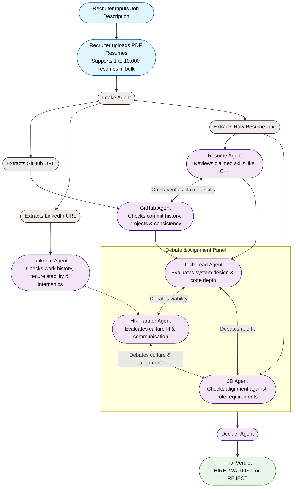

<div align="center">
  

  # HirePanel.ai
  ### The Autonomous AI Hiring Committee that Vets Candidates in less than 30 seconds

  [](https://fastapi.tiangolo.com/)
  [](https://react.dev/)
  [](https://tailwindcss.com/)
  [](https://groq.com/)
  [](https://meta.ai/)
  [](https://ollama.com/)

  HirePanel.ai is a multi-agent screening system that automates the initial stages of technical recruiting. By parsing uploaded resumes, analyzing candidate codebases on GitHub, evaluating work history on LinkedIn, and running a structured debate between virtual Tech Lead and HR roles, HirePanel delivers a comprehensive candidate evaluation and consensus verdict in under 30 seconds.

  ### Links
  - [Live Video Demo](https://www.linkedin.com/posts/mahesh-nandigam_ai-agenticai-techcommunity-ugcPost-7474855620551241728-O5H9/?utm_source=share&utm_medium=member_desktop&rcm=ACoAADW99hsBJVeFIsEk7TLOg9YovphT7Sd-cWg)
  - [Live App Link](https://hirepanel-ai.vercel.app)
</div>

---

## Architecture and Agent Choreography

HirePanel.ai structures candidate screening as a pipeline of cooperative, specialized AI agents. The workflow progresses sequentially from the initial setup down to the final verdict:



---

## Key Features

- **Fast Evaluations (Groq Cloud):** Processes candidate profiles concurrently using Llama-3.3-70b on Groq, completing evaluations in less than 30 seconds.
- **Evidence-Based Reasoning:** Extracts candidate details directly from uploaded PDFs, ensuring all strengths and areas of concern are supported by direct citations.
- **Dynamic Peer Review:** Employs a debate between Tech Lead and HR Partner personas to balance technical competence with long-term retention and team fit.
- **Resilient API Layer:** Includes a Groq API Key Rotator supporting up to 10 keys to prevent rate limit blocks, alongside a local fallback to Ollama (running gemma3:4b or llama3) for offline stability.
- **Real-Time Dashboards:** Features a dashboard tracking active agent status, detailed side-by-side agent debate logs, and candidate rankings.
- **Data Export:** Supports exporting evaluation metrics, notes, and final decisions to CSV.

---

## Meet The Committee

- **Intake Agent:** Parses raw candidate resumes to extract contact information, structured text, and links to external portfolios (GitHub, LinkedIn).
- **GitHub Agent:** Scans the candidate's GitHub footprint to inspect commit frequency, codebase complexity, project architectures, and coding consistency.
- **LinkedIn Agent:** Examines career timeline stability. Checks work tenure longevity, patterns of switching between employers, internship completions, and general trajectory consistency.
- **Resume Agent:** Reviews the candidate's self-claimed credentials and technical competencies (e.g. C++). Cross-verifies these claims with the GitHub Agent to confirm if the candidate has actual project repositories backing up their stated expertise.
- **JD Agent:** Maps the parsed candidate profile directly against the target Job Description to identify matching competencies, missing requirements, and overall alignment.
- **Tech Lead Agent:** Focuses strictly on technical execution. Evaluates the candidate's system design depth, technical architecture choices, and code quality.
- **HR Partner Agent:** Evaluates culture fit, communication competence, team alignment, and professional durability.
- **Decider Agent:** Reviews the final scores, aggregates weights, reads the transcript of the debate between the JD, Tech Lead, and HR agents, and renders a final verdict (HIRE, WAITLIST, or REJECT) with an executive summary.

---

## Codebase Structure

```directory
hirepanel.ai/
├── src/
│   ├── main.py                 # FastAPI Application (Endpoints: /api/intake, /api/evaluate)
│   ├── agents/
│   │   ├── intake_agent.py     # Parses PDFs and extracts structured details
│   │   ├── jd_agent.py         # Matches candidate experiences to the target job description
│   │   ├── github_agent.py     # Analyzes developer profiles and code repository footprints
│   │   ├── linkedin_agent.py   # Analyzes career timelines and workplace longevity
│   │   ├── resume_agent.py     # Reviews details, credentials, and achievements
│   │   ├── debate_agents.py    # Powers the Tech Lead and HR debate cycle
│   │   └── decider_agent.py    # Formulates final decision and executive summaries
│   └── utils/
│       └── groq_client.py      # LLM client with Groq Key Rotator & Local Ollama Fallback
├── frontend/
│   ├── src/                    # React (Vite) Frontend Components & Dashboard UI
│   ├── package.json
│   └── vite.config.js
├── Dockerfile                  # Application deployment packaging
└── requirements.txt            # Backend Python dependencies
```

---

## Quickstart Guide

### Prerequisites
- Python 3.10+
- Node.js 18+
- [Optional] Ollama running locally (for local model fallbacks)

### 1. Clone the Repository
```bash
git clone https://github.com/Mahesh-Nandigam/HirePanel.Ai.git
cd HirePanel.Ai
```

### 2. Set Up the Backend (FastAPI)
Create a Python virtual environment and install the required dependencies:
```bash
python -m venv .venv
# On Windows (PowerShell):
.venv\Scripts\Activate.ps1
# On Linux/macOS:
source .venv/bin/activate

pip install -r requirements.txt
```

Create a `.env` file in the root directory and add your Groq API keys:
```env
# .env
DEMO_MODE=True
GROQ_API_KEY=gsk_your_primary_key_here
GROQ_API_KEY_1=gsk_your_second_key_here
GROQ_API_KEY_2=gsk_your_third_key_here
```
> [!NOTE]
> Setting DEMO_MODE=True tells the system to bypass local Ollama setups and prioritize the Groq cloud endpoint for faster evaluation times.

Start the backend server:
```bash
python -m uvicorn src.main:app --host 0.0.0.0 --port 8001 --reload
```

### 3. Set Up the Frontend (React + Vite)
Open a new terminal window or tab and set up the interface:
```bash
cd frontend
npm install
npm run dev
```

### 4. Run and Test the Application
1. Open your browser to http://localhost:5173.
2. Input a Job Description (or use the preloaded template).
3. Upload candidate resumes (PDF format).
4. Click Start Evaluation and watch the AI hiring committee execute the interview assessment live!

---

## Reliability & Fail-safes
If you run out of Groq API limits:
1. The GroqKeyRotator immediately switches to the next available environment key.
2. If all API keys run dry, or if you disable DEMO_MODE (DEMO_MODE=False), the backend falls back gracefully to a locally running Ollama instance (gemma3:4b or llama3) to ensure data evaluation never stops.

---

<div align="center">
  <i>Designed and built for the future of technical recruiting.</i>
</div>
