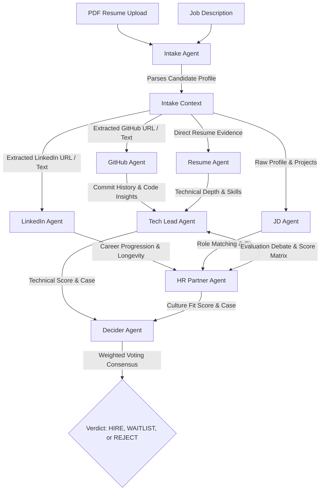

  # HirePanel.ai
  ### *The Autonomous AI Hiring Committee that Vets Candidates in <30 Seconds*


  **Manual recruiting is cooked.**  
  *HirePanel.ai* is an elite, multi-agent AI panel that acts as a fully autonomous hiring committee. It reads resumes, extracts verifiable evidence, crawls GitHub and LinkedIn, debates alignment on technical and culture fits, and renders an executive verdict—all in under 30 seconds.

  ### [Watch the Live Video Demo on LinkedIn](https://www.linkedin.com/posts/mahesh-nandigam_ai-agenticai-techcommunity-ugcPost-7474855620551241728-O5H9/?utm_source=share&utm_medium=member_desktop&rcm=ACoAADW99hsBJVeFIsEk7TLOg9YovphT7Sd-cWg)
</div>

---

## Architecture & Agent Choreography

Unlike simple keyword scanners (ATS) that search for matching words, **HirePanel.ai** models a real-world recruiting panel. Multiple specialized AI agents analyze the candidate from distinct, often conflicting perspectives, engage in a debate, and vote on the final verdict.



---

## Key Features

- **Blazing Fast (Groq Cloud):** Processes and evaluates candidate portfolios in parallel in under 30 seconds using Llama-3.3-70b on Groq.
- **Resume-Driven Intelligence:** Zero generic templates. Every score, strength, and concern is directly cited with evidence found in the uploaded PDF.
- **Dynamic Committee Debate:** The Tech Lead evaluates system design, code patterns, and technical depth. The HR Partner reviews job hopper indicators, career progression, and cultural suitability. They challenge each other dynamically.
- **Enterprise API Reliability:** Features a built-in API Key Rotator (supports rotating up to 10 keys to bypass free-tier rate limits) and automatic Local Ollama Fallback (`gemma3:4b` or `llama3`) when cloud calls fail.
- **Interactive Dashboard:** A beautiful Glassmorphism UI displaying real-time agent progression, score matrices, side-by-side agent debate logs, and leaderboards.
- **One-Click CSV Export:** Export evaluation summaries, candidate metrics, and the Decider's verdict instantly.

---

## Meet The Committee

| Agent | Focus Area | Source Inputs | Key Output |
| :--- | :--- | :--- | :--- |
| **Intake Agent** | Information Extraction | Raw PDF Resume | Structured Candidate JSON (URLs, Text, Contact) |
| **JD Agent** | Role Relevance Alignment | Resume Text + Job Description | Score alignment, missing requirements, critical fits |
| **GitHub Agent** | Open Source & Project Depth | GitHub URL / Resume Projects | Code complexity, architecture patterns, repo stats |
| **LinkedIn Agent** | Career Stability & Longevity | LinkedIn URL / Career History | Work tenure, promotion frequency, career growth indicators |
| **Tech Lead Agent** | Technical Competence | JD + GitHub + Resume outputs | System design rating, code depth, core technical score |
| **HR Partner Agent** | Culture & Organizational Fit | LinkedIn + Resume outputs | Communication skills, teamwork potential, longevity rating |
| **Decider Agent** | Final Panel Consensus | Tech Lead & HR Debate + Scores | Final decision (`HIRE`, `WAITLIST`, `REJECT`) & Executive Summary |

---

## Codebase Structure

```directory
hirepanel.ai/
├── src/
│   ├── main.py                 # FastAPI Application (Endpoints: /api/intake, /api/evaluate)
│   ├── agents/
│   │   ├── intake_agent.py     # Parses PDFs and extracts structured details
│   │   ├── jd_agent.py         # Matches candidate experiences to the target job description
│   │   ├── github_agent.py     # Analyzes developer profiles and code repository footprints
│   │   ├── linkedin_agent.py   # Analyzes career timelines and workplace longevity
│   │   ├── resume_agent.py     # Reviews details, credentials, and achievements
│   │   ├── debate_agents.py    # Powers the Tech Lead and HR debate cycle
│   │   └── decider_agent.py    # Formulates final decision and executive summaries
│   └── utils/
│       └── groq_client.py      # LLM client with Groq Key Rotator & Local Ollama Fallback
├── frontend/
│   ├── src/                    # React (Vite) Frontend Components & Dashboard UI
│   ├── package.json
│   └── vite.config.js
├── Dockerfile                  # Application deployment packaging
└── requirements.txt            # Backend Python dependencies
```

---

## Quickstart Guide

### Prerequisites
- Python 3.10+
- Node.js 18+
- [Optional] Ollama running locally (for local model fallbacks)

### 1. Clone the Repository
```bash
git clone https://github.com/Mahesh-Nandigam/HirePanel.Ai.git
cd HirePanel.Ai
```

### 2. Set Up the Backend (FastAPI)
Create a Python virtual environment and install the required dependencies:
```bash
python -m venv .venv
# On Windows (PowerShell):
.venv\Scripts\Activate.ps1
# On Linux/macOS:
source .venv/bin/activate

pip install -r requirements.txt
```

Create a `.env` file in the root directory and add your Groq API keys:
```env
# .env
DEMO_MODE=True
GROQ_API_KEY=gsk_your_primary_key_here
GROQ_API_KEY_1=gsk_your_second_key_here
GROQ_API_KEY_2=gsk_your_third_key_here
```
> [!NOTE]
> Setting `DEMO_MODE=True` tells the system to bypass local Ollama setups and prioritize the Groq cloud endpoint for lightning-fast speeds.

Start the backend server:
```bash
python -m uvicorn src.main:app --host 0.0.0.0 --port 8001 --reload
```

### 3. Set Up the Frontend (React + Vite)
Open a new terminal window or tab and set up the interface:
```bash
cd frontend
npm install
npm run dev
```

### 4. Run & Test the Application
1. Open your browser to `http://localhost:5173`.
2. Input a Job Description (or use the preloaded template).
3. Upload candidate resumes (PDF format).
4. Click **Start Evaluation** and watch the AI hiring committee execute the interview assessment live!

---

## Reliability & Fail-safes
If you run out of Groq API limits:
1. The **GroqKeyRotator** immediately switches to the next available environment key.
2. If all API keys run dry, or if you disable `DEMO_MODE` (`DEMO_MODE=False`), the backend falls back gracefully to a locally running Ollama instance (`gemma3:4b` or `llama3`) to ensure data evaluation never stops.

---

<div align="center">
  <i>Designed and built for the future of technical recruiting.</i>
</div>
